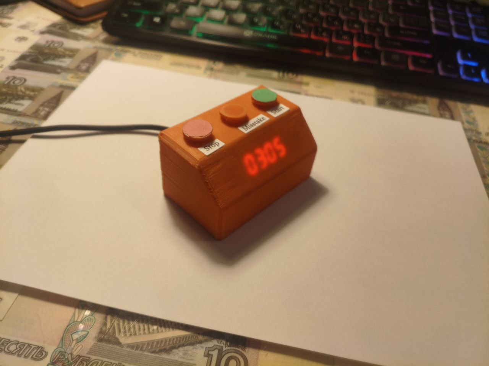
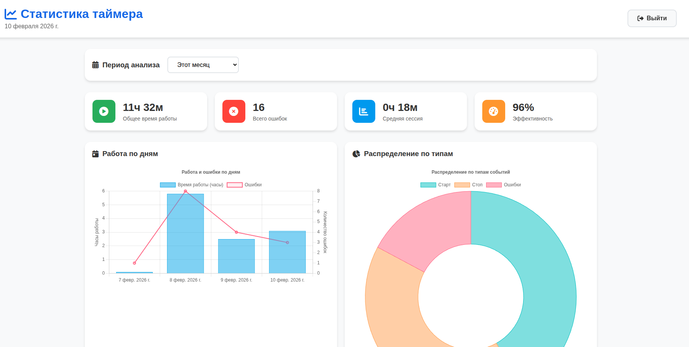
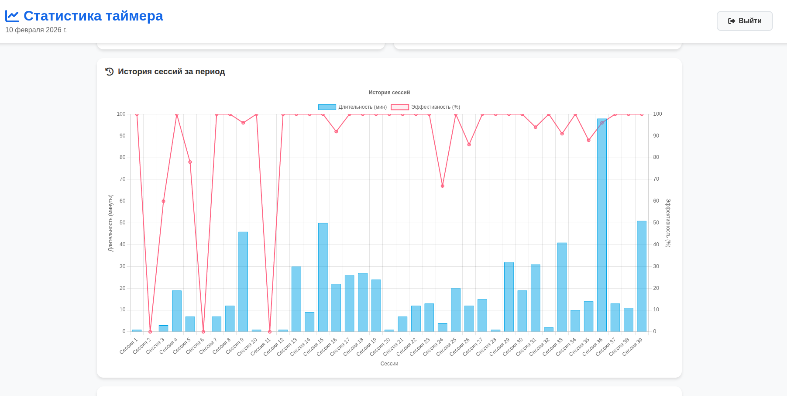
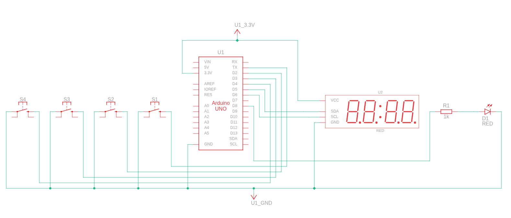
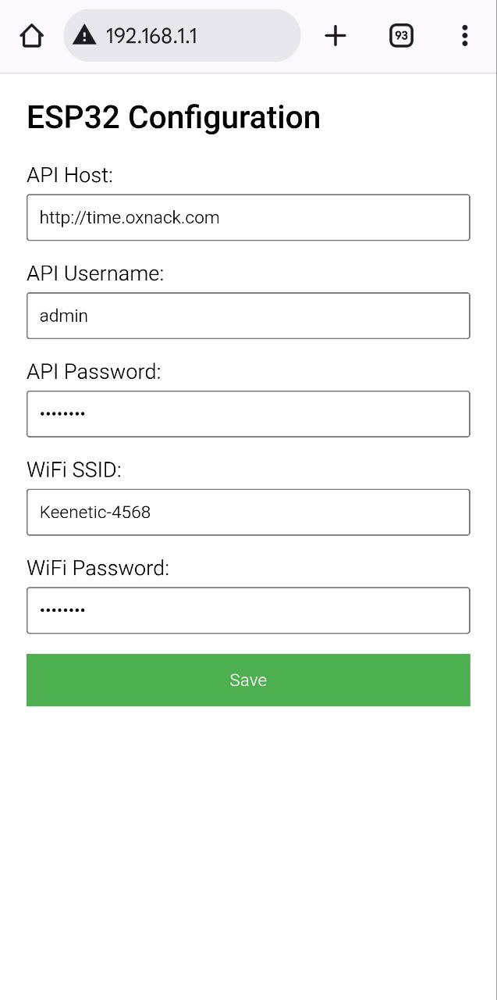
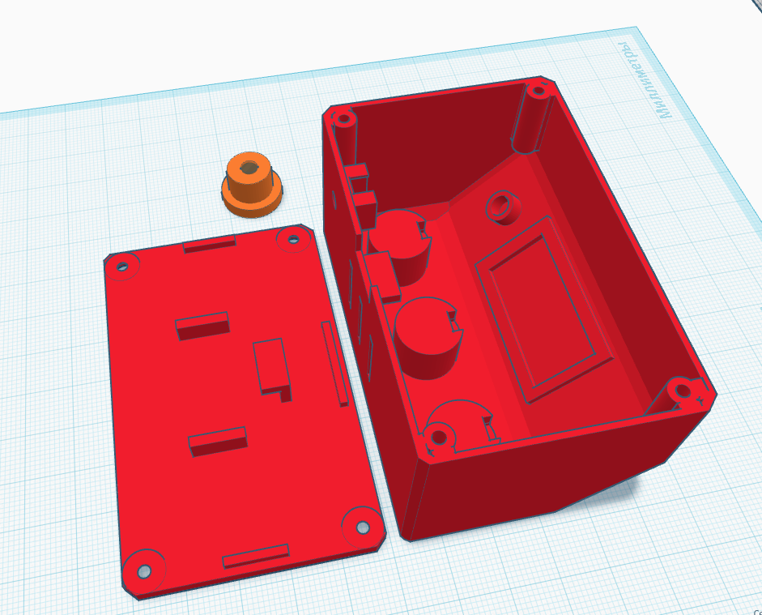

# MotivationTimer  

**MotivationTimer** is a smart Wi-Fi timer based on ESP8266 for personal productivity tracking and time management. It helps monitor work sessions, reduce procrastination, and collect activity statistics.

---

## How It Works?

The device sits on your desk with a display and buttons:
- **Start** — begin a work session.
- **Mistake** — press if you get distracted or waste time unproductively.
- **Stop** — end the session or take a break.

The timer stays connected to Wi-Fi and sends your actions to a backend server, where detailed statistics are generated. You can view them via a web panel, analyze your efficiency, and adjust your workflow.

  
*Timer appearance (temporary enclosure)*

---

## Project Structure

The system consists of three main components:

1. **Backend** — FastAPI server with PostgreSQL for data storage and event processing.
2. **Web Panel** — authenticated interface for viewing statistics and charts.
3. **Firmware** — MicroPython code for ESP8266 (timer and button control).
4. **Enclosure** — 3D model for 3D printing.

---

### Web Panel

  
*Web interface overview*

  
*Example session statistics*

---

## ESP8266 Connection Diagram

  
*NOTE: the diagram is based on Arduino, but ESP8266 is connected similarly.*

### Pinout Table

| ESP8266 Pin | GPIO | Connected Component | Function |
|-------------|------|---------------------|----------|
| D1 | GPIO5 | Button (momentary) | **Start** – begin a work session |
| D2 | GPIO4 | Button (momentary) | **Stop** – short press: end session / **Reset** – long press (≥3s): reset timer |
| D3 | GPIO0 | Button (momentary) | **Mistake** – log a distraction/procrastination event |
| D4 | GPIO2 | Button (momentary) | **Config** – press to launch ESP web configurator (Access Point mode) |
| D5 | GPIO14 | TM1637 Display (CLK) | Clock line for 4-digit 7-segment LED display |
| D6 | GPIO12 | TM1637 Display (DIO) | Data I/O line for 4-digit 7-segment LED display |
| 3.3V | — | TM1637 VCC | Display power (3.3V) |
| GND | — | TM1637 GND | Common ground for display and buttons |
| VIN / 5V | — | External PSU | 5V power input (USB or external adapter) |

### Button Wiring

All buttons are connected with **internal pull-up** resistors enabled in software (`Pin.PULL_UP`). Connect each button between the corresponding GPIO pin and **GND** – no external resistors required.

```
GPIOx  ────[ Button ]──── GND
```

### TM1637 Display Wiring

```
TM1637       ESP8266
------       -------
VCC    -->   3.3V
GND    -->   GND
CLK    -->   D5 (GPIO14)
DIO    -->   D6 (GPIO12)
```

---

## Installation & Setup

### 1. Backend (FastAPI + PostgreSQL)

#### Quick Start:
1. Start PostgreSQL and create a database (details in `UseDB.py`).
2. Configure settings: create `config.py` based on `example-config.py`.
3. Install dependencies and run the server:

```bash
python3 -m venv venv
source venv/bin/activate
pip install -r requirements.txt
fastapi run api.py
```

---

### 2. ESP8266 Firmware

#### Preparing the Microcontroller:

1. **Flash MicroPython to ESP8266:**
```bash
esptool.py --port /dev/ttyUSB0 erase_flash
esptool.py --port /dev/ttyUSB0 --baud 460800 write_flash --flash_size=detect 0 firmware/micropython.bin
```
*Replace `/dev/ttyUSB0` with your actual port.*

2. **Upload Project Files to ESP:**
```bash
ampy --port /dev/ttyUSB0 put esp-ai-optimisation.py main.py
```

3. **Wi-Fi Configuration:**
   - After boot, wait 5 seconds and press the button on pin D4.
   - Connect to the Wi-Fi network `ESP8266_Config`.
   - Go to `192.168.1.1` and fill in the parameters (SSID, Wi-Fi password, server address, etc.).
   - Click **Save**.

  
*ESP8266 web configuration interface*

---

## 3D-Printable Enclosure

The project includes a 3D model of the enclosure (`Timer.stl`) for 3D printing.

  
*3D model of the timer enclosure*

---

## Conclusion

**MotivationTimer** is an open-source project designed to help you stay focused and disciplined. We are constantly improving the system and welcome your feedback and contributions.

For any questions, including **free connection to our statistics server**, contact us via Telegram bot: [@OxnackSupport_bot](https://t.me/OxnackSupport_bot).